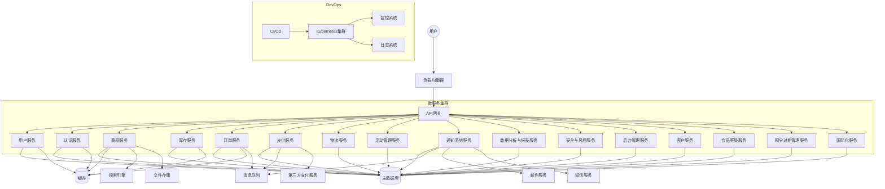

# 积分商城系统详细设计

## 1. 系统架构
我们将采用微服务架构，以提高系统的可扩展性和维护性。主要组件包括：
1. 前端应用（Web和移动端）
2. API网关
3. 微服务集群
4. 消息队列
5. 缓存系统
6. 数据库集群
7. 搜索引擎
8. 文件存储系统

### 架构图

## 2. 主要模块设计
### 2.1 用户管理模块
- 功能：注册、登录、个人信息管理、积分余额查询
- API:
  - POST /api/users/register
  - POST /api/users/login
  - GET /api/users/profile
  - PUT /api/users/profile
  - GET /api/users/points

### 2.2 积分管理模块
- 功能：积分获取、积分消耗、积分记录
- API:
  - POST /api/points/earn
  - POST /api/points/spend
  - GET /api/points/history

### 2.3 商品管理模块
- 功能：商品展示、商品详情、库存管理
- API:
  - GET /api/products
  - GET /api/products/{id}
  - PUT /api/products/{id}/stock

### 2.4 兑换功能模块
- 功能：积分兑换、兑换记录
- API:
  - POST /api/exchange
  - GET /api/exchange/history

### 2.5 订单管理模块
- 功能：订单生成、订单查询、订单取消
- API:
  - POST /api/orders
  - GET /api/orders
  - PUT /api/orders/{id}/cancel

### 2.6 支付模块
- 功能：支付接口对接、订单支付
- API:
  - POST /api/payments/{orderId}
  - GET /api/payments/{orderId}
  - PUT /api/payments/{orderId}/confirm
  - PUT /api/payments/{orderId}/cancel
  - GET /api/payments/{orderId}/refund
  - GET /api/payments/{orderId}/status
  - POST /api/payments/{orderId}/refund

### 2.7 物流管理模块
- 功能：物流跟踪、发货管理
- API:
  - GET /api/logistics/{orderId}
  - PUT /api/logistics/{orderId}/ship

### 2.8 活动管理模块
- 功能：积分活动、促销活动
- API:
  - GET /api/promotions
  - POST /api/promotions
  - PUT /api/promotions/{id}

### 2.9 通知系统模块
- 功能：消息通知、系统公告
- API:
  - POST /api/notifications
  - GET /api/notifications
  - GET /api/announcements

### 2.10 数据分析与报表模块
- 功能：用户行为分析、销售报表、积分报表
- API:
  - GET /api/analytics/user-behavior
  - GET /api/reports/sales
  - GET /api/reports/points

### 2.11 安全与风控模块
- 功能：账户安全、风控系统
- API:
  - POST /api/security/2fa
  - POST /api/risk/check

### 2.12 后台管理模块
- 功能：权限管理、系统设置
- API:
  - GET /api/admin/roles
  - PUT /api/admin/settings

### 2.13 客户服务模块
- 功能：在线客服、帮助中心
- API:
  - POST /api/support/chat
  - GET /api/faq

### 2.14 会员等级模块
- 功能：等级体系
- API:
  - GET /api/membership/levels
  - GET /api/membership/benefits

### 2.15 积分过期管理模块
- 功能：有效期设置
- API:
  - PUT /api/points/expiry
  - GET /api/points/expiring

### 2.16 国际化模块
- 功能：多语言和多货币支持
- API：
  - GET /api/localization/languages
  - GET /api/localization/currencies

## 3. 数据库设计
使用关系型数据库（如PostgreSQL）作为主数据库，并使用Redis作为缓存和会话存储。

主要数据表：
1. users (用户表)
2. points_transactions (积分交易表)
3. products (商品表)
4. orders (订单表)
5. order_items (订单项表)
6. logistics (物流表)
7. promotions (活动表)
8. notifications (通知表)
9. announcements (公告表)
10. user_behaviors (用户行为表)
11. roles (角色表)
12. permissions (权限表)
13. settings (系统设置表)
14. membership_levels (会员等级表)
15. faq (常见问题表)
16. languages (语言表)
17. currencies (货币表)

## 4. API设计
我们将采用RESTful API设计原则，使用JSON作为数据交换格式。API版本控制将通过URL中的版本号实现（例如：/api/v1/users）。
认证将使用JWT（JSON Web Tokens）实现，所有API调用都需要在Header中包含有效的token。

## 5. 技术栈选择
### 前端：
- Web：React.js + Next.js（服务端渲染）
- 移动端：React Native（跨平台移动应用）
- 状态管理：Redux + Redux Toolkit
- UI组件库：Material-UI

### 后端：
- 主要语言：Python 3.9+
- Web框架：FastAPI
- 微服务框架：Nameko
- 数据库：PostgreSQL (主数据库), Redis (缓存和会话存储)
- ORM：SQLAlchemy
- 消息队列：RabbitMQ
- 搜索引擎：Elasticsearch
- API文档：Swagger UI (通过FastAPI自动生成)

### DevOps：
- 容器化：Docker
- 容器编排：Kubernetes
- CI/CD：GitLab CI/CD
- 监控：Prometheus + Grafana
- 日志管理：ELK Stack (Elasticsearch, Logstash, Kibana)

### 安全：
- HTTPS加密
- OAuth 2.0 + OpenID Connect用于第三方登录
- Passlib用于密码哈希
- Starlette的安全中间件用于设置安全相关的HTTP头

### 其他：
- 文件存储：Amazon S3或自建MinIO
- CDN：Cloudflare或Akamai
- 支付集成：Stripe API
- 短信服务：Twilio
- 邮件服务：SendGrid

## 6.扩展性和性能优化
1. 使用负载均衡器分发流量
2. 实现数据库读写分离
3. 利用Redis进行热点数据缓存
4. 使用CDN加速静态资源加载
5. 实现异步处理机制，使用消息队列处理非实时任务
6. 采用合适的数据库索引策略
7. 实现数据分片，提高数据库性能
8. 使用服务端渲染提高首屏加载速度

## 7. 安全性考虑
1. 实现频率限制（Rate Limiting）防止API滥用
2. 使用CSRF令牌防止跨站请求伪造
3. 实现数据验证和清洁，防止XSS攻击
4. 使用参数化查询防止SQL注入
5. 实现多因素认证（MFA）增强账户安全
6. 定期安全审计和渗透测试
7. 敏感数据加密存储
8. 实现完善的日志记录和监控系统，及时发现异常行为

## 8. 部署策略
1. 使用蓝绿部署或金丝雀发布策略
2. 实现自动化部署流程
3. 使用环境变量管理不同环境的配置
4. 实现健康检查和自动扩缩容
5. 制定完善的备份和恢复策略
6. 使用服务网格（如Istio）管理服务间通信

## 9. Python特定实现细节
- 异步编程（asyncio和FastAPI）
- 依赖注入
- 类型提示
- 后台任务处理（Celery）
- 数据验证（Pydantic）
- 测试框架（pytest）
- 代码风格（Black和Flake8）
- 环境管理（Poetry）
- 配置管理（python-dotenv）
- 日志处理