# 积分商城系统数据库设计

## 实体关系图 (ER Diagram)

```mermaid
erDiagram
    USERS ||--o{ POINTS_TRANSACTIONS : "拥有"
    USERS ||--o{ ORDERS : "下单"
    USERS ||--o{ USER_BEHAVIORS : "产生"
    USERS }|--|| MEMBERSHIP_LEVELS : "属于"
    USERS }|--o{ NOTIFICATIONS : "接收"
    USERS }|--o{ ROLES : "拥有"

    ROLES }|--o{ PERMISSIONS : "包含"

    PRODUCTS ||--o{ ORDER_ITEMS : "包含于"
    PRODUCTS ||--o{ POINTS_TRANSACTIONS : "关联"
    PRODUCTS }|--o{ PROMOTIONS : "参与"

    ORDERS ||--o{ ORDER_ITEMS : "包含"
    ORDERS ||--|| LOGISTICS : "关联"
    ORDERS ||--o{ PAYMENTS : "关联"

    ANNOUNCEMENTS ||--o{ NOTIFICATIONS : "生成"

    SETTINGS }|--|| SYSTEM : "配置"

    LANGUAGES }|--o{ PRODUCTS : "描述"
    CURRENCIES }|--o{ PRODUCTS : "定价"

    MEMBERSHIP_LEVELS ||--o{ BENEFITS : "提供"

    FAQ }|--o{ CATEGORIES : "分类"

    USERS {
        uuid id PK
        string username
        string email
        string phone
        string password_hash
        string salt
        datetime created_at
        datetime updated_at
        boolean is_active
        string avatar_url
        string address
        json preferences
        uuid membership_level_id FK
    }

    POINTS_TRANSACTIONS {
        uuid id PK
        uuid user_id FK
        integer points
        string transaction_type
        string description
        datetime created_at
        datetime expires_at
        uuid related_entity_id
        string related_entity_type
        boolean is_expired
    }

    PRODUCTS {
        uuid id PK
        string name
        string description
        integer points_price
        decimal cash_price
        integer stock
        string image_url
        string category
        boolean is_active
        datetime created_at
        datetime updated_at
        json attributes
        uuid currency_id FK
    }

    ORDERS {
        uuid id PK
        uuid user_id FK
        datetime created_at
        datetime updated_at
        string status
        integer total_points
        decimal total_cash
        string shipping_address
        string contact_phone
        string contact_name
        uuid currency_id FK
    }

    ORDER_ITEMS {
        uuid id PK
        uuid order_id FK
        uuid product_id FK
        integer quantity
        integer points_price
        decimal cash_price
        string status
    }

    LOGISTICS {
        uuid id PK
        uuid order_id FK
        string tracking_number
        string carrier
        string status
        datetime shipped_at
        datetime delivered_at
        json tracking_history
    }

    PROMOTIONS {
        uuid id PK
        string name
        string description
        datetime start_date
        datetime end_date
        string promotion_type
        json rules
        boolean is_active
    }

    NOTIFICATIONS {
        uuid id PK
        uuid user_id FK
        string title
        string content
        boolean is_read
        datetime created_at
        string notification_type
        uuid related_entity_id
        string related_entity_type
        uuid announcement_id FK
    }

    ANNOUNCEMENTS {
        uuid id PK
        string title
        string content
        datetime published_at
        datetime expires_at
        boolean is_active
        string importance
    }

    USER_BEHAVIORS {
        uuid id PK
        uuid user_id FK
        string behavior_type
        json data
        datetime created_at
        string ip_address
        string user_agent
    }

    ROLES {
        uuid id PK
        string name
        string description
        datetime created_at
        datetime updated_at
    }

    PERMISSIONS {
        uuid id PK
        string name
        string description
        string resource
        string action
    }

    SETTINGS {
        uuid id PK
        string key
        string value
        string description
        string category
        datetime updated_at
    }

    MEMBERSHIP_LEVELS {
        uuid id PK
        string name
        string description
        integer required_points
        json benefits
        string color_code
    }

    BENEFITS {
        uuid id PK
        uuid membership_level_id FK
        string name
        string description
        string benefit_type
        json value
    }

    FAQ {
        uuid id PK
        string question
        string answer
        uuid category_id FK
        integer display_order
        boolean is_active
    }

    CATEGORIES {
        uuid id PK
        string name
        string description
        integer display_order
    }

    LANGUAGES {
        uuid id PK
        string code
        string name
        string native_name
        boolean is_active
        string flag_image
    }

    CURRENCIES {
        uuid id PK
        string code
        string name
        string symbol
        decimal exchange_rate
        boolean is_active
    }

    PAYMENTS {
        uuid id PK
        uuid order_id FK
        string payment_method
        string status
        decimal amount
        string currency
        datetime created_at
        datetime updated_at
        string transaction_id
        json payment_details
    }

    USER_ROLES {
        uuid user_id FK
        uuid role_id FK
    }

    ROLE_PERMISSIONS {
        uuid role_id FK
        uuid permission_id FK
    }

    PRODUCT_PROMOTIONS {
        uuid product_id FK
        uuid promotion_id FK
    }
```

## 数据表说明

### 1. users (用户表)
存储系统用户信息，包括基本个人信息、认证信息和会员等级。

### 2. points_transactions (积分交易表)
记录所有积分的获取和消费记录，包括交易类型、数量、过期时间等。

### 3. products (商品表)
存储系统中可兑换的商品信息，包括名称、描述、价格（积分和现金）、库存等。

### 4. orders (订单表)
记录用户的订单信息，包括订单状态、总价、收货信息等。

### 5. order_items (订单项表)
记录订单中的具体商品项，包括商品ID、数量、价格等。

### 6. logistics (物流表)
存储订单的物流信息，包括物流单号、承运商、物流状态等。

### 7. promotions (活动表)
存储系统中的促销活动信息，包括活动名称、规则、有效期等。

### 8. notifications (通知表)
存储发送给用户的各类通知，包括积分变动、订单状态变更等。

### 9. announcements (公告表)
存储系统公告信息，可被转化为通知发送给用户。

### 10. user_behaviors (用户行为表)
记录用户在系统中的行为数据，用于分析和个性化推荐。

### 11. roles (角色表)
定义系统中的角色，如管理员、普通用户等。

### 12. permissions (权限表)
定义系统中的权限项，可被分配给不同角色。

### 13. settings (系统设置表)
存储系统的各种配置项，如积分规则、兑换比例等。

### 14. membership_levels (会员等级表)
定义系统中的会员等级体系，包括等级名称、所需积分等。

### 15. benefits (会员权益表)
定义不同会员等级可享受的权益。

### 16. faq (常见问题表)
存储常见问题及答案，用于帮助中心。

### 17. categories (分类表)
用于对FAQ和商品进行分类。

### 18. languages (语言表)
存储系统支持的语言信息。

### 19. currencies (货币表)
存储系统支持的货币信息，包括汇率等。

### 20. payments (支付表)
记录订单的支付信息，包括支付方式、状态、金额等。

### 21. user_roles (用户角色关联表)
用户和角色的多对多关系表。

### 22. role_permissions (角色权限关联表)
角色和权限的多对多关系表。

### 23. product_promotions (商品活动关联表)
商品和促销活动的多对多关系表。

## 关键关系说明

1. 用户(USERS)与积分交易(POINTS_TRANSACTIONS)：一对多，一个用户可以有多条积分交易记录。

2. 用户(USERS)与订单(ORDERS)：一对多，一个用户可以有多个订单。

3. 用户(USERS)与会员等级(MEMBERSHIP_LEVELS)：多对一，多个用户可以属于同一会员等级。

4. 订单(ORDERS)与订单项(ORDER_ITEMS)：一对多，一个订单包含多个订单项。

5. 订单(ORDERS)与物流(LOGISTICS)：一对一，一个订单对应一条物流记录。

6. 商品(PRODUCTS)与订单项(ORDER_ITEMS)：一对多，一个商品可以出现在多个订单项中。

7. 角色(ROLES)与权限(PERMISSIONS)：多对多，通过role_permissions表关联。

8. 用户(USERS)与角色(ROLES)：多对多，通过user_roles表关联。

9. 商品(PRODUCTS)与促销活动(PROMOTIONS)：多对多，通过product_promotions表关联。

10. 会员等级(MEMBERSHIP_LEVELS)与权益(BENEFITS)：一对多，一个会员等级可以有多个权益。